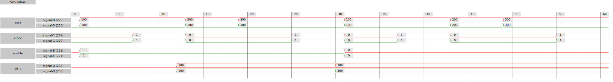
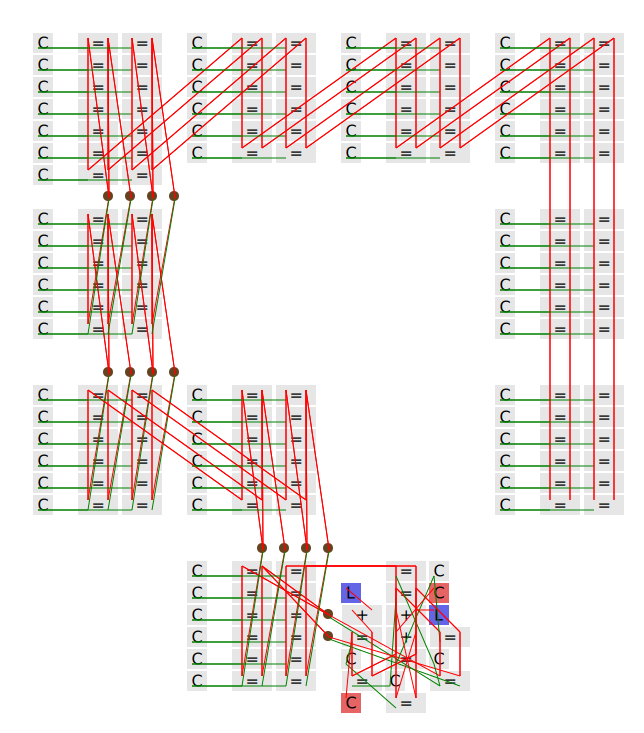
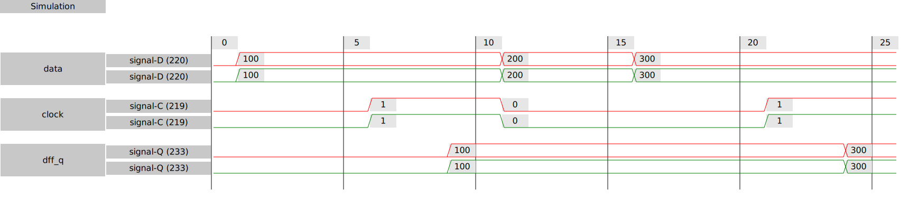
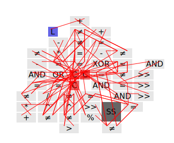
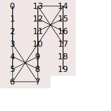

# v2f
This file describes this repository and tool. v2f is short for "Verilog to Factorio."

[](https://github.com/ben-j-c/verilog2factorio/actions/workflows/rust.yml) [](https://github.com/ben-j-c/verilog2factorio/actions/workflows/codespaces/create_codespaces_prebuilds)

# Purpose
The purpose of this tool is to allow Factorio players to use Verilog to describe combinator circuits.
An additional purpose is to provide a simple API for describing combinators, so players can manually
create designs.
* Take a Verilog file and outputs json blueprint strings that can be imported in Factorio 2.0.
* Exposes a Rust and Lua API for players to make designs in code.

# How to get started

## With prebuilt development image

Click the following to open a dev container on a github hosted machine:

[](https://codespaces.new/ben-j-c/verilog2factorio?quickstart=1)

Once you click through, you will get a development machine ready to use the tool. Follow the [Lua](#lua) or [CLI](#cli) sections to continue.

## Local with docker

The second easiest way is to install VSCode and Docker. Also install the [dev-containers](https://marketplace.visualstudio.com/items?itemName=ms-vscode-remote.remote-containers) extension for VSCode.

1. Clone the repo into you preferred working directory.
2. Open the repo with VSCode, you should be prompted to re-open in a dev-container. Select yes.
   - If not, press ctrl-p and type `>reopen` and select "Dev containers: Reopen in container"

### Lua

The Lua API reference is [here](https://github.com/ben-j-c/verilog2factorio/blob/master/src/v2f_api.lua). It contains all the functions and constructs that let you make a design, simulate it, and realize the physical representation.

Once you have your environment running, you can create a new lua file
and run it by clicking `"Run and Debug" > "Current lua file"`. This will 
cause the project to compile, so the first run may take ~30 seconds to start.

Subsequent runs should start instantly.

With the "Run and Debug" set to "Current lua file" you can press F5 to run the currently open lua file.

### CLI

You only need to set `V2F_ROOT` to the repo root and update `PATH` to include `$(V2F_ROOT)/target/release`.

You can do this automatically by executing `source env.bash`. This will add the
needed environment variables and alias `v2f` to the release binary in this repo.

Make sure you execute `cargo build --release` before you try to use `v2f`.

For more info use `v2f --help`.

#### CLI -- Invoke a Lua Script

Typical usage would be to execute a lua script and get a blueprint:
```bash
$ v2f -i xyz.lua -o blueprint.json
```
Note: Without `-o` the json will be printed to screen.

#### CLI -- Running On Mapped Designs

If your design is being inefficiently generated, you may want to modify the front-end mapping. Yosys is the rtl and word-level generation.

If you want to mess with the yosys scripts you can invoke `v2f` on the `*rtl_map.json` produced from the yosys front-end:

```bash
# A normal flow, just used to produce the rtl.ys and mapping.ys scripts
$ v2f -i my_full_flow_script.lua
<output>
$ yosys -s rtl.ys
<output>
$ yosys -s mapping.ys
<output>
$ v2f -i my_full_flow_design_rtl_map.json -o blueprint.json
<output>
```

There is a desired feature to allow you to tweak the yosys pass, but that isn't available now. To do that, you need to follow the process like above.

# Bare Metal
An alternative to docker is to just setup the software manually.

To install the dependencies, run
```bash
sudo apt install metis lua5.4 liblua5.4-0 liblua5.4-dev pkg-config gperf build-essential bison flex libreadline-dev gawk tcl-dev libffi-dev git graphviz xdot pkg-config python3 libboost-system-dev libboost-python-dev libboost-filesystem-dev zlib1g-dev
```
Build yosys
```bash
cd yosys
git submodule update --init --recursive
make config-gcc
make -j$(nproc)
```

# Docs
Read the docs to get a better understanding on how to use the APIs. For beginners, the Lua flow is recommended. It uses a more object oriented and type flexible design.

# Sample images

## RISC-V 32 Bit Processor

Under [`/examples/riscv_v2f_optimized/top_v2f`](https://github.com/ben-j-c/riscv_v2f_optimized/tree/master/top_v2f) I have compiled a fully functional RISC-V processor (RV32IM) along with some example programs that run in the game. The design is originally from Ultraembedded, but I have tweaked the multiplication and division to synthesize a more efficient design.

Once compiled and the clock started, the [`hello_world`](https://github.com/ben-j-c/riscv_v2f_optimized/blob/master/top_v2f/programs/hello_world.c) program runs and produces the following result. I had a little bug in the ASCII font, so the smiley face is frowning. I have not yet rerun this program to get a better picture.


Here is an image of what the core looks like. This is their diagram, and is identical to mine.


Wrapping their core is a fabric that provides the display output and access to a programmable RAM. Here is a diagram of the total system, plus the memory layout I have defined in [`sys_device.h`](https://github.com/ben-j-c/riscv_v2f_optimized/blob/master/top_v2f/programs/sys_device.h).


To help facilitate the programming process I setup a cross compiler targeting a freestanding RV32IM. This is simply done with the [GNU toolchain](https://github.com/riscv-collab/riscv-gnu-toolchain). I keep the makefiles and scripts in a subdirectory of the `top_v2f` mentioned above ([link](https://github.com/ben-j-c/riscv_v2f_optimized/tree/master/top_v2f/programs)). Here is the hello world implementation.


## Simulation traces for a DFFE
The program can also simulate your design so you can experiment more quickly in code rather than in game. Here is a simple DFF simulation I do in the tests to verify functionality.


## 64 word ROM
This program supports generating SVGs of your designs so you don't need to import them into factorio to get an idea of what it looks like. Here is an example placement for a 64x32 bit ROM with two ports. I call this physical design rendering. This ROM is in the test_designs folder where you can see the verilog and the yosys script. The physical design rendering can also be annotated with the simulation state; this allows for much better global visibility over the traces at the expense of time visibility. If you open this SVG in a new tab, you can get hover text for each combinator which describes the input and output signals.



## Simulation traces for a DFF



## ALU Placement
In the [ALU example](examples/lua/alu), you can see how to use the Lua to generate images. The following image is the physical design rendering for a 32 bit ALU. The Verilog and Lua flow code can be seen in the examples folder.


## Animated Physical Placement
Here is an output from one of the synthetic tests. It's a single partition thats being placed analytically after initialization.


